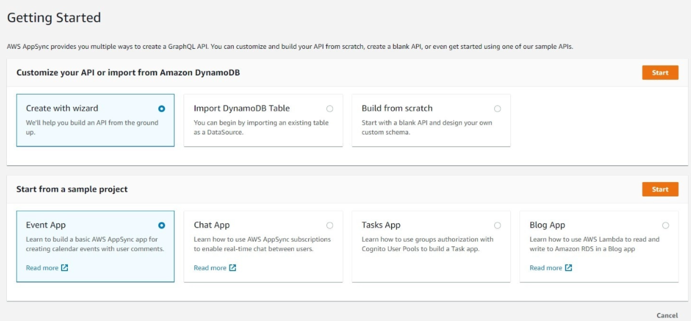

### AWS AppSync com Spring Boot


# 1. Introdução
Neste artigo, exploraremos o AWS AppSync com Spring Boot. O AWS AppSync é um serviço GraphQL de nível empresarial totalmente gerenciado com sincronização de dados em tempo real e recursos de programação offline.

# 2. Configure o AWS AppSync
Primeiro, precisamos ter uma conta AWS ativa. Depois de cuidar disso, podemos pesquisar o AppSync no console da AWS. Em seguida, clicaremos no link Getting Started with AppSync.

### 2.1. Criar API AppSync
Seguindo as instruções de início rápido para criar nossa API, usaremos o projeto de amostra Event App. Em seguida, clique em Iniciar para nomear e criar o aplicativo:



Isso nos levará ao nosso console de aplicativo AppSync. Agora, vamos dar uma olhada em nosso modelo GraphQL.

### 2.2. Modelo de Evento GraphQL
GraphQL usa um esquema para definir quais dados estão disponíveis para os clientes e como interagir com o servidor GraphQL. O esquema contém consultas, mutações e uma variedade de tipos declarados.

Para simplificar, vamos dar uma olhada em parte do esquema AWS AppSync GraphQL padrão, nosso modelo de evento:

```
type Event {
  id: ID!
  name: String
  where: String
  when: String
  description: String
  # Paginate through all comments belonging to an individual post.
  comments(limit: Int, nextToken: String): CommentConnection
}
```

O evento é um tipo declarado com alguns campos String e um tipo CommentConnection. Observe o ponto de exclamação no campo ID. Isso significa que é um campo obrigatório / não nulo.

Isso deve ser suficiente para entender os fundamentos do nosso esquema. No entanto, para obter mais informações, visite o site GraphQL.

# 3. Spring Boot
Agora que configuramos tudo no lado da AWS, vamos dar uma olhada em nosso aplicativo cliente Spring Boot.

### 3.1. Dependências Maven
Para acessar nossa API, usaremos a biblioteca Spring Boot Starter WebFlux para acessar o WebClient, a nova alternativa do Spring para RestTemplate:

```
<dependency> 
      <groupId>org.springframework.boot</groupId> 
      <artifactId>spring-boot-starter-webflux</artifactId> 
    </dependency>
```

Confira nosso artigo sobre WebClient para obter mais informações.

### 3.2. Cliente GraphQL
Para fazer uma solicitação à nossa API, começaremos criando nosso RequestBodySpec usando o construtor WebClient, fornecendo o URL da API do AWS AppSync e a chave da API:

```
WebClient.RequestBodySpec requestBodySpec = WebClient
    .builder()
    .baseUrl(apiUrl)
    .defaultHeader("x-api-key", apiKey)
    .build()
    .method(HttpMethod.POST)
    .uri("/graphql");
```

Não se esqueça do cabeçalho da chave API, x-api-key. A chave de API é autenticada em nosso aplicativo AppSync.

# 4. Trabalho com tipos GraphQL
### 4.1. Consultas
Configurar nossa consulta envolve adicioná-la a um elemento de consulta no corpo da mensagem:

```
Map<String, Object> requestBody = new HashMap<>();
requestBody.put("query", "query ListEvents {" 
  + " listEvents {"
  + "   items {"
  + "     id"
  + "     name"
  + "     where"
  + "     when"
  + "     description"
  + "   }"
  + " }"
  + "}");
```

Usando nosso requestBody, vamos invocar nosso WebClient para recuperar o corpo da resposta:

```
WebClient.ResponseSpec response = requestBodySpec
    .body(BodyInserters.fromValue(requestBody))
    .accept(MediaType.APPLICATION_JSON, MediaType.APPLICATION_XML)
    .acceptCharset(StandardCharsets.UTF_8)
    .retrieve();
```

Finalmente, podemos obter o corpo como uma String:

```
String bodyString = response.bodyToMono(String.class).block();
assertNotNull(bodyString);
assertTrue(bodyString.contains("My First Event"));
```

### 4.2. Mutações
GraphQL permite atualizar e excluir dados por meio do uso de mutações. As mutações modificam os dados do lado do servidor conforme necessário e seguem uma sintaxe semelhante para as consultas.

Vamos adicionar um novo evento com uma consulta add mutation:

```
String queryString = "mutation add {"
  + "    createEvent("
  + "        name:\"My added GraphQL event\""
  + "        where:\"Day 2\""
  + "        when:\"Saturday night\""
  + "        description:\"Studying GraphQL\""
  + "    ){"
  + "        id"
  + "        name"
  + "        description"
  + "    }"
  + "}";
 
requestBody.put("query", queryString);
```

Uma das maiores vantagens do AppSync, e do GraphQL em geral, é que um URL de endpoint fornece toda a funcionalidade CRUD em todo o esquema.

Podemos reutilizar o mesmo WebClient para adicionar, atualizar e excluir dados. Simplesmente obteremos uma nova resposta com base no retorno de chamada na consulta ou mutação.

```
assertNotNull(bodyString);
assertTrue(bodyString.contains("My added GraphQL event"));
assertFalse(bodyString.contains("where"));
```

# 5. Conclusão
Neste artigo, vimos com que rapidez podemos configurar um aplicativo GraphQL com AWS AppSync e acessá-lo com um cliente Spring Boot.

O AppSync fornece aos desenvolvedores uma API GraphQL poderosa por meio de um único endpoint. Para obter mais informações, dê uma olhada em nosso tutorial sobre como criar um servidor GraphQL Spring Boot.